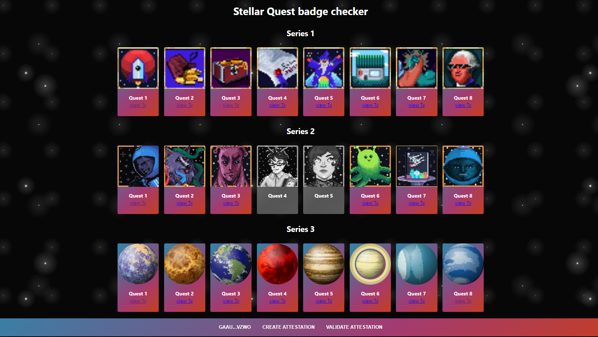
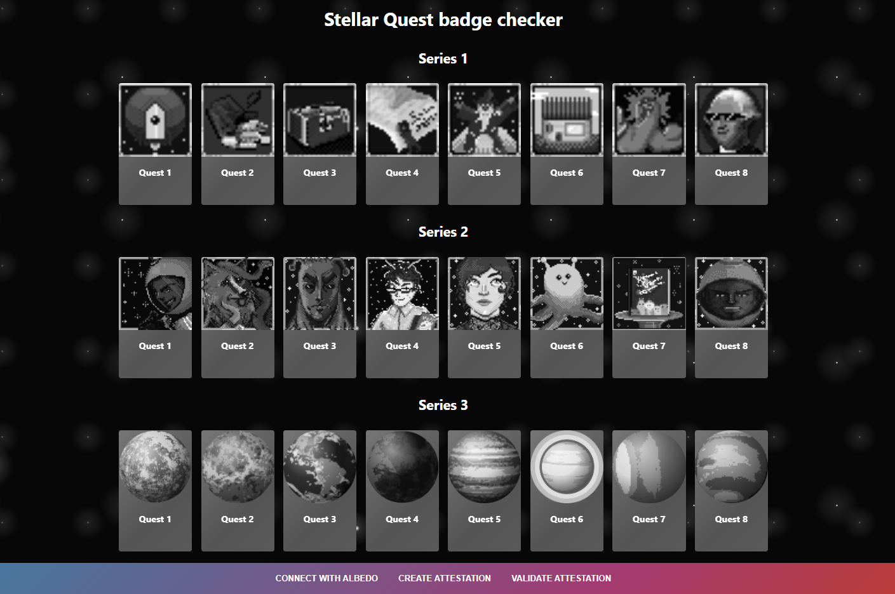

# Stellar Quest Badge checker

\

## Features
* Connect with albedo and view your Stellar quest badges.
* Export a signed and verifiable token to proof that you have those badges.
* verify an exported token.

### Viewing badges

* When not connected with albedo, the badges are shown as greyscale.
* When connected with albedo the valid badges are shown with color while the invalid badges are shown as greyscale.
* When connected, a query parameter is added to the url,e.g., [link](http://badge.rahimklaber.me/?address=GAAUMMCT5PVLB5SP7FJYDXKZYDFJLXLJ34EXFREMDWOZLKYVE2PNVZWO), which can be shared.

### Exporting attestation

* Clicking on the `CREATE ATTESTATION` button brings up a window, where an attestation can be generated.
* Extra data can be added to make the attestation recognizable to someone.
* When the attestation is created, a file is downloaded containing the attestation string.

### Verifying attestation
* Clicking on the `VERIFY ATTESTATION` button brings up a window, where an attestation can be checked.
* The attestation string must be placed in the text field.
* After clicking to verify the attestation, the window closes and an appbar appears ontop.
* The appbar contains info on whether the verification was successfully, the date it was created and the extra data which was used to generate the attestation.
* A query parameter is also added to the url,e.g.,[link](http://badge.rahimklaber.me/?attestation=113601bc6f4a5a72a4033d079f77f67f51450895315cff6c3f2cbb38d2318d67ff%2C12ec7356eb40fd8359c5aec54c51e292c393434ce9797d3a24985f45e9cf36c48b%2C13710b86bfbff16f64ddff7fad7859f4032caaaab4eedf9688f4a08649e81b975b%2C14ca31094e018dc058612fe03d4407a43e87fdb8da1012cf6e6530c88cc2b28283%2C155f25e7b67a566b01c1549a4b9ccff9f147e431e6019f88178b049493277f3e30%2C164bd8efba25d168ffcad6b10667f0f96aaa6065e009bcf01932dc3c2515cc93c7%2C17130684c48c78384a15db787306d821e4023318aad640307fc0b1c1506e4f2f4c%2C18fa46affd0deb114b808737f292055138008b7be662cd603e0425e108d22979c7%2C21f1460c64f65ee4e6b60020cdc280c1819fbbe9d3c8e4831655b2b5a46c34290f%2C22658b0f54afd01cb308814ddcdd34ab6e257a8abcde61e6209e8b86d8a30b735e%2C235981a00b401deb127714e1720b37e70642603901f115bcab77cbf845c9fa6763%2C261166b89f10ada0d8516aaa8203e7d61de0f761572c775a35e518d32dd06989bb%2C27baf3cf852b30f26f6823d87da1a88ac7cb033ad728bad5a8f98701eea92138e7%2C2820fb43b54df90c56c7faa690e01b7deed3e79b1076292541c8fbf6945e1658ef%2C311032c0564bb459814b050ddf5f2125eaace6196023a86da5cf4ad8fde432bf69%2C325eb6b3c39d69911fe836e85d878c9cf5c3575469fde855aad256b384cf224761%2C3366f770df2fbc74ee6982b5d7e9a94afbf7dcb890ca8fbdb5853e3adfc965fa3a%2C34077c9f461214b8e464f34fcd933cd9dd5eeb9839d0fba4d6694b66a65b8eddce%2C35b9b55980aec9dfd05bea36a3e31b9e5f226b1f1d98874eaf1a538509b6b39c00%2C362ab6fce454e574140b3172f2a0c28efc3d5a7a41e29578f77bf9d5d8ef575c32%2C373f2fe091b7e6e93946b7d65d2e3fe42b06465c70025849b1a2fa9d992d77d136%2C387f4ebc3e4a1b935c6035a863cd26fcd2f66ab430b76b454b388243c0494ff927*1627525727787*GAAUMMCT5PVLB5SP7FJYDXKZYDFJLXLJ34EXFREMDWOZLKYVE2PNVZWO*0ec2fbafc3639b15f54c6682e4ed7eb8cf0ca4d84f78ad866b10fe4dede7e5d66af518cdcacdcfbe44989988ca98c277d9734647de28e66cb02767b1f2d19107), which can be shared.

## Development
This project was built using [yarn](https://yarnpkg.com/) as the package Manager.

`yarn start` - start the Development server with hot reload.\
`yarn build` - create a production build.

## Acknowledgments
This project is powered by https://pqina.nl/